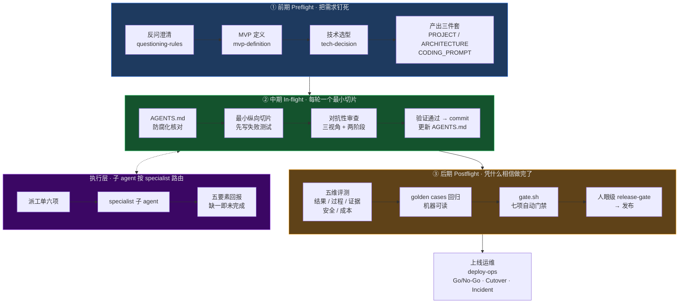

<div align="center">


**让 AI 写代码不翻车的全流程导航 Skill**

> 代码廉价，判断昂贵。AI 几分钟能生成几百行代码，但"要什么、怎么证明改对了、错了回哪、上线出事谁管"——这些判断不能外包。

<br>


</div>

---

## 📌 这是什么

**Vibecoding Navigator** 不是教你写代码的 Skill，而是教你的 coding agent **怎么把项目从想法推到上线而不翻车**的流程基础设施。

它把一次 vibecoding 拆成三段确定性流程，外加一个可审计的执行层：

| 阶段 | 做什么 | 翻车成本 |
|---|---|---|
| **① 前期 Preflight** | 把需求、架构、技术选型钉死 | **最低**——所以做最重 |
| **② 中期 In-flight** | 每轮一个最小纵向切片，先写失败测试，验证通过才 commit | 中——错了能回滚 |
| **③ 后期 Postflight** | 五维评测 + 机器可读 golden cases + 七项自动门禁 | **最高**——所以做最严 |
| **执行层** | 编排层派工单 → 子 agent 按 specialist 路由干活 → 五要素回报 | — |

> 适配 Claude Code / Codex / OpenCode / CodeBuddy / WorkBuddy 等一切支持 Agent Skill 的宿主。

---

## 🎯 它解决什么问题

Vibecoding 的翻车几乎总是同四种死法。这个 Skill 对每种都有确定的答案：

| | 💀 死法 | 😵 典型症状 | ✅ 本 Skill 的答案 |
|---|---|---|---|
| 1 | **需求没想清楚就开工** | 反复返工，AI 在模糊需求上自由发挥 | `questioning-rules` 逐个反问 + MVP 定义 + DoR/DoD 两张 checklist |
| 2 | **切片太大，一次做不完** | 无法验证、无法回滚，错了一步全盘重来 | 最小纵向切片 + 失败测试先行 + 每个切片独立 commit |
| 3 | **AI 说"完成了"无法验证** | 幻觉完成、happy path 一把梭、带病上线 | 五要素回报 + 证据落盘 + 对抗性三视角审查 + 五维评测 |
| 4 | **上线之后没人管** | 出了事不知道找谁、怎么回滚、怎么复盘 | Go/No-Go 准入 + Cutover 切换 + Incident 六步 + Runbook 体系 |

---

## 🏗 架构总览



### 三层职责，边界清晰

| 层 | 所有权 | 核心文件 |
|---|---|---|
| **编排层** | 流程所有权**永不外包**：定义切片、验收标准、回滚点 | `references/` 三段流程 |
| **执行层** | 子 agent × N，按 specialist 路由干活，只传结构化结果 | `docs/execution-protocol.md` |
| **知识层** | 7 个契约化 specialist，只回答"怎么写"，不回答"做什么" | `specialists/` |

---

## ⚙️ 核心机制

| 机制 | 规格 | 防住什么 |
|---|---|---|
| **派工单** | 六项：切片定义 / 接口契约 / 禁区 / 专家知识 / 验证命令 / 硬规则，缺一项不派工 | 派工不清导致返工 |
| **五要素回报** | 文件清单、验证命令原始输出全文、证据路径、自审结论、冲突标记，缺一即未完成 | AI 幻觉"完成了" |
| **七项自动门禁** | git 干净度 / debug 残留 / 密钥泄露 / 依赖漏洞 / 构建 / 测试 / golden cases，FAIL 即阻断发布 | 带病上线 |
| **路由测试执行器** | 15 条用例：schema + 路由真实存在 + 防路由漂移 + specialist 覆盖 | 路由表烂掉 |
| **DoR / DoD** | 两张 checklist：DoR 管住"别急着派工"，DoD 管住"别急着合并" | 半成品流转 |
| **可追溯链** | PROJECT → ARCHITECTURE → 切片 → Commit → 证据 → Release → Feedback | "这代码为什么存在"无人能答 |

---

## 📂 目录结构

```
vibecoding-navigator/
├── README.md                   # 本文件：项目门面
├── SKILL.md                    # 入口：六条铁律 + 路由表 + 新项目七步
├── CHANGELOG.md                # 版本演进记录（含真实冒烟记录）
├── INSTALL.md                  # 五平台安装 + git 升级 + 兼容性分层说明
├── VERSION                     # 当前版本号（与 frontmatter / CHANGELOG 一致）
├── LICENSE                     # MIT
├── .github/workflows/          # CI：push/PR 自动跑路由测试 + 版本一致性
├── docs/                       # 执行层协议与门禁（5 个文件）
│   ├── execution-protocol.md       # 派工单六项 / 五要素回报 / 并行与仲裁
│   ├── ownership-matrix.md         # 多专家冲突所有权矩阵
│   ├── evidence-format.md          # 证据格式与落盘规范
│   ├── stack-routing.md           # 技术栈路由唯一事实源
│   └── quickstart.md               # 30 分钟端到端 walkthrough
├── references/                 # 三段流程方法论（20 个文件）
│   ├── 00-preflight/                # 前期：反问 / MVP / 选型 / 变更管理 / 模板
│   ├── 01-in-flight/                # 中期：切片纪律 / 对抗审查 / git 纪律 / AGENTS.md
│   └── 02-postflight/               # 后期：五维评测 / golden cases / 发布门禁
├── specialists/                 # 7 个契约化技术专家
│   ├── agent-architecture/          # LLM / Agent / RAG / MCP / 多 Agent / 评测调优
│   ├── ts-react-electron/           # TS / React / Electron / SQLite（含 4 个 vendored skills）
│   ├── python-fastapi/              # Python / FastAPI / pytest
│   ├── java-spring/                 # Java / Spring Boot / Maven / MyBatis / JPA / JUnit
│   ├── vue3/                        # Vue 3 / Vite / Pinia / Element Plus / Vue Router / Vitest
│   ├── web-react/                   # React / Next.js / Vercel
│   └── deploy-ops/                  # CI/CD / Go-No-Go / Cutover / Incident / Runbook
├── scripts/
│   └── gate.sh                      # 七项自动发布门禁（复制进你的项目用）
└── tests/
    ├── routing-cases.json           # 15 条路由用例（机器可读）
    ├── run-routing-tests.py         # 路由测试执行器（仅标准库）
    └── check-version.py             # 版本一致性检查（三处版本号强制一致）
```

---

## 🚀 快速开始

> **第一次用（30 分钟）**：读 [`docs/quickstart.md`](docs/quickstart.md)，跟一个 todo app 端到端跑通：复制模板 → 反问定 MVP → 产出三个 md → 派第一个切片 → 收五要素回报 → 门禁通过 → commit。

**装进你的 agent**（详细平台表见 [`INSTALL.md`](INSTALL.md)）：

```bash
# 以 Claude Code 为例，用户级安装（其他平台换对应路径）
git clone https://github.com/louisss1016/vibecoding-navigator.git ~/.claude/skills/vibecoding-navigator

# 升级（skill 发新版本后）
cd ~/.claude/skills/vibecoding-navigator && git pull
```

安装后对 agent 说 **"开始 vibecoding，我想做个 XX"**——它应该先读 `references/00-preflight/questioning-rules.md` 开始反问你，而不是直接写代码。**这就是装对了。**

**验证安装**：skill 根目录跑 `python tests/run-routing-tests.py`，15 条用例应全部 PASS；`python tests/check-version.py` 校验三处版本号一致。这两项在 CI 里对每次 push 自动执行（见上方徽章）。

---

## 🧪 质量保证：这个 Skill 按自己的纪律构建

> 流程类文档最大的风险是**文档里说有、实际跑不起来**。本仓库的执行标准：所有推荐的命令和流程都经过真实执行。

- ✅ **CI 自动门禁**：每次 push / PR 自动跑路由测试 + 版本一致性检查 + `gate.sh` 语法校验（`.github/workflows/routing-tests.yml`）——本 skill 铁律"CI 回归：不想起来才跑"先约束自己
- ✅ **路由测试**：15/15 PASS（执行器首跑即抓到一处真实路由漂移并修复，记录在 CHANGELOG v2.2.0）
- ✅ **冒烟验证**：用零依赖 todo app 真跑 `gate.sh`，首跑 FAIL 2 → 修复 → PASS 6 | WARN 2 | FAIL 0，全程记录在案
- ✅ **文档命令保鲜**：连"文档推荐的命令自己过期"这种事都抓到过——Node 22 起 `node --test tests/` 语义变化导致的坑，已写进 quickstart 卡点表
- ✅ **版本纪律**：`VERSION` / `SKILL.md` frontmatter / `CHANGELOG.md` 三处版本号由 `tests/check-version.py` 强制一致，不再靠人工核对

---

## 🧭 技术栈路由

| 技术栈信号 | 路由到 |
|---|---|
| LLM / Agent / 工具调用 / RAG / MCP / 多步任务 / 评测调优 | `specialists/agent-architecture/` |
| TypeScript / React / Electron / SQLite / Playwright | `specialists/ts-react-electron/` |
| Python / FastAPI / pytest | `specialists/python-fastapi/` |
| Java / Spring / Spring Boot / Maven / MyBatis / JPA / JUnit | `specialists/java-spring/` |
| Vue / Vue 3 / Vite / Pinia / Element Plus / Vue Router | `specialists/vue3/` |
| React / Next.js / Vercel | `specialists/web-react/` |
| 部署 / CI / 域名 / SSL / 回滚 / 监控 / 日志 / 备份 | `specialists/deploy-ops/` |

> 技术栈专家只回答"怎么写"，不回答"做什么"和"做到哪算完"——后者是三段流程的领地。每个 specialist 头部带 `contract` 契约块，派工前先读契约再派工。

---

## 📈 版本演进

| 版本 | 主题 |
|---|---|
| **v2.5.0** | 新增 Vue 3 前端专家：组合式 API、Pinia 边界、Element Plus 按需引入、history 模式 nginx fallback、VITE_ 变量不进客户端包 |
| **v2.4.0** | 新增 Java/Spring Boot 专家：分层铁律、构造器注入、事务三条高压线、Flyway 迁移、JPA N+1、四层测试，Java 项目不再走兜底 |
| **v2.3.1** | 仓库工程化：CI 自动门禁、MIT LICENSE、版本一致性检查、git 安装/升级机制 |
| **v2.3.0** | 融合企业级研发 SOP：AI 五层测试面、Go/No-Go 上线准入、Cutover / Incident 体系、DoR/DoD、CR 十项优先级、变更影响七维 |
| **v2.2.0** | 外部评审闭环：路由测试从数据升级为可执行门禁、30 分钟 quickstart、agent-architecture 快速入口 |
| **v2.1.0** | 融合 Agent 工程契约：新增 agent-architecture 专家、评测工程化、多 Agent 升级判据 |
| **v2.0.0** | 从"人肉执行手册"升级为"可上线产品生产线"：执行层协议、证据规范、deploy-ops、golden cases 机器可读化 |

完整历史见 [`CHANGELOG.md`](CHANGELOG.md)。

---

## 🧭 设计哲学

> **前期做重**，因为前期翻车成本最低；**后期验收做严**，因为发布后翻车成本最高。

三条贯穿全部文件的原则：

1. **导航层不复制技术细节**——技术内容全在 `specialists/`，按需加载，`SKILL.md` 永远是一张地图而不是一本百科
2. **没有证据的"完成"是幻觉**——测试输出贴全文、截图落盘、AGENTS.md 引路径，三段缺一不可
3. **流程所有权永不外包**——AI 可以执行切片，但"做什么、做到哪算完、错了退到哪"永远由编排层决定

---

<div align="center">

**如果这个 Skill 帮你少翻了一次车，欢迎 Star ⭐**

[报告问题](https://github.com/louisss1016/vibecoding-navigator/issues) · [查看变更](https://github.com/louisss1016/vibecoding-navigator/blob/main/CHANGELOG.md) · [30 分钟上手](docs/quickstart.md)

</div>
